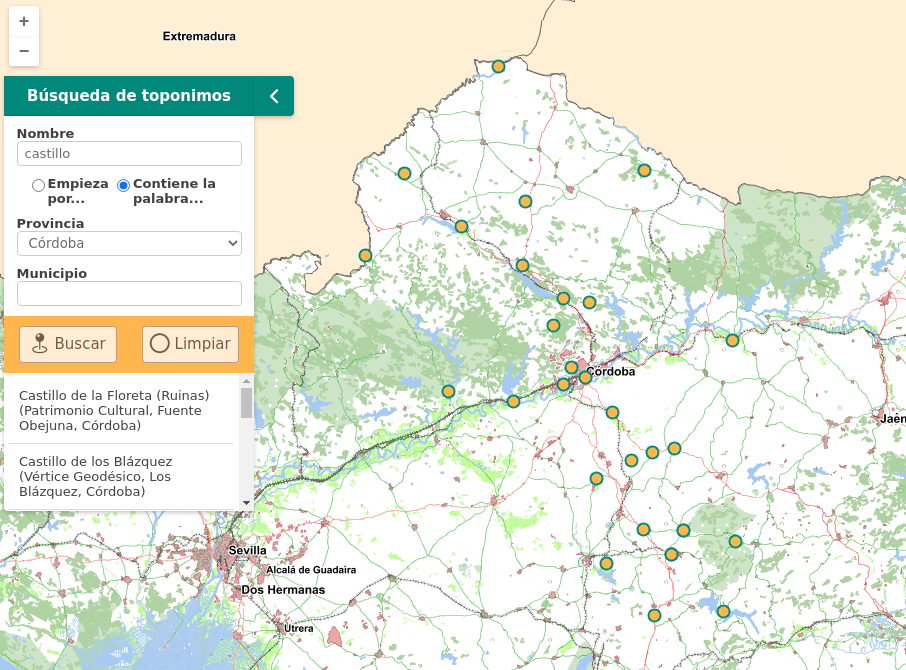

# M.plugin.Toponomysearch

Plugin que permite realizar búsquedas de topónimos contra el servicio wfs-nga del Instituto de Estadística y Cartografía de Andalucía.



# Dependencias

- toponomysearch.ol.min.js
- toponomysearch.ol.min.css

# Parámetros

Sin parámetros

# Ejemplos de uso

### Ejemplo 1
```javascript
   const map = M.map({
     container: 'map'
   });

   const mp = new M.plugin.Toponomysearch();
   map.addPlugin(mp);
```